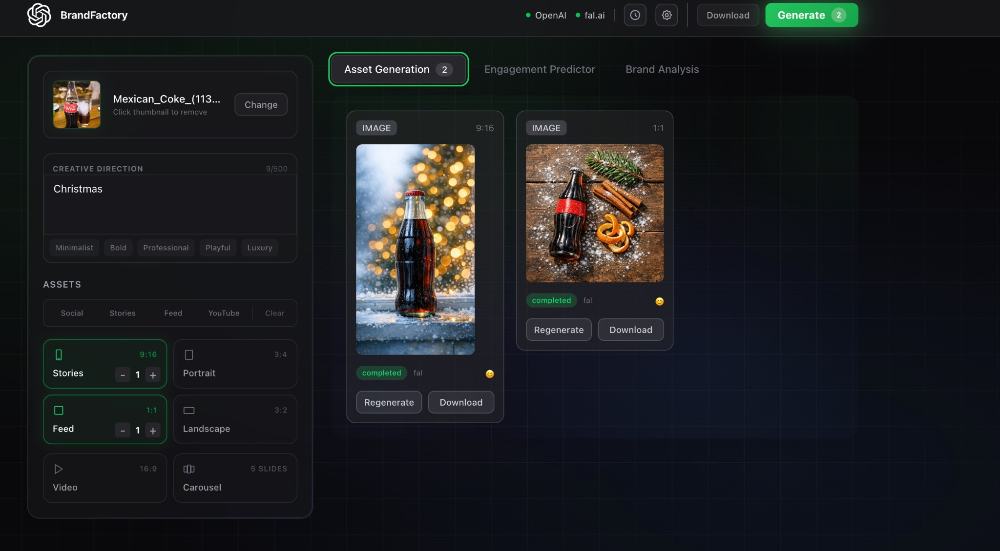
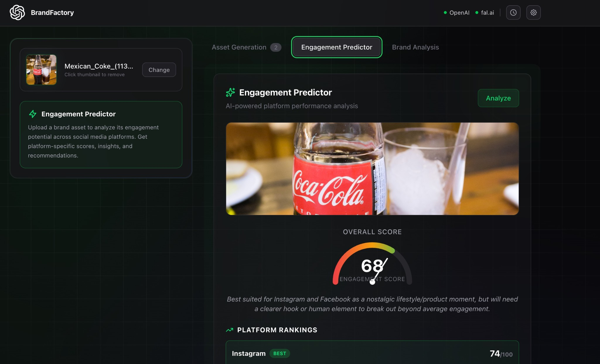

# 🎨 BrandFactory

**AI-Powered Creative Asset Generator**

BrandFactory is an AI-powered Web application that uses OpenAI GPT-5.2's Vision and Language Capabilities along with GPT-Image-1.5 and SORA 2 to generate professional brand assets, analyze engagement potential, and create comprehensive brand strategies.


*Generate multi-format brand assets with AI-powered prompt engineering*


*Predict engagement potential across social media platforms*

---

## ✨ Features

### 🎯 Asset Generation
- **Multi-format Assets**: Generate social posts, portraits (3:4), square (1:1), landscape (16:9) images, videos, and carousel posts
- **AI-Powered Prompts**: GPT-5.2 with reasoning creates photographer-quality prompts
- **Brand Context Analysis**: Automatically extracts brand identity from uploaded images
- **Smart Ad Copy**: AI-generated headlines, body text, and CTAs for each asset

### 📊 Engagement Predictor
- **Engagement Scoring**: 0-100 score predicting social media performance
- **Platform Analysis**: Predicts best-performing platforms (Instagram, LinkedIn, Twitter/X, TikTok, Facebook)
- **Actionable Insights**: Strengths, improvements, and key insights for optimization
- **Visual Scanning Effect**: X-ray style analysis animation

### 🎯 Brand Strategy
- **Target Audience Profiling**: Demographics, psychographics, interests, pain points, aspirations
- **Brand Archetype**: Identifies your brand's personality (The Creator, The Hero, etc.)
- **Positioning Statement**: Clear one-line brand positioning
- **Messaging Pillars**: Core messaging themes for consistent communication
- **Content Themes**: Recurring content ideas aligned with brand identity
- **Platform-Specific Posts**: Sample captions, hooks, hashtags, and best posting times
- **PDF Export**: Download comprehensive brand strategy reports

---

## 🚀 Quick Start

### Prerequisites

- Node.js 20+ installed
- OpenAI API key (with GPT-5.2 access) (primary)
- Fal.ai API key (for image/video generation) (fallback)

### Installation

```bash
# Clone the repository
git clone <your-repo-url>
cd adfactory

# Install dependencies
npm install

# Run the development server
npm run dev
```

Open [http://localhost:3000](http://localhost:3000) in your browser.

### API Keys Setup

On first launch, you'll be prompted to enter:

1. **OpenAI API Key**: Get it from [platform.openai.com/api-keys](https://platform.openai.com/api-keys)
   - Required for: Prompt generation, image analysis, ad copy, engagement analysis, brand strategy, image generation, video generation
   - Models used:
     - Text/Analysis: `gpt-5.2` (with reasoning capabilities)
     - Image Generation: `gpt-image-1.5`
     - Video Generation: `sora-2`

2. **Fal.ai API Key** (Optional): Get it from [fal.ai/dashboard](https://fal.ai/dashboard)
   - Used as fallback if OpenAI fails or rate limits
   - Models used:
     - Image Generation: `fal-ai/gpt-image-1.5`
     - Video Generation: `fal-ai/sora-2/image-to-video`

Keys are stored securely in your browser's local storage.

---

## 📁 Project Structure

```
adfactory/
├── src/
│   ├── app/                    # Next.js App Router
│   │   ├── page.tsx           # Main application page
│   │   ├── layout.tsx         # Root layout
│   │   └── globals.css        # Global styles & animations
│   │
│   ├── components/            # React components
│   │   ├── asset-card.tsx          # Individual asset display
│   │   ├── asset-grid.tsx          # Grid of generated assets
│   │   ├── asset-config.tsx        # Asset configuration UI
│   │   ├── brand-analyzer.tsx      # Brand strategy analysis
│   │   ├── engagement-analyzer.tsx # Engagement prediction
│   │   ├── upload-zone.tsx         # Image upload interface
│   │   ├── carousel-editor.tsx     # Carousel content editor
│   │   └── ...                     # Other UI components
│   │
│   ├── services/              # Business logic & API calls
│   │   ├── ai/
│   │   │   ├── promptGeneration.ts      # GPT-5.2 prompt generation
│   │   │   ├── imageAnalysis.ts         # Brand context extraction
│   │   │   ├── adCopyGeneration.ts      # Ad copy creation
│   │   │   ├── engagementAnalysis.ts    # Engagement prediction
│   │   │   ├── brandStrategyAnalysis.ts # Brand strategy
│   │   │   ├── imageGeneration.ts       # Image generation (Fal.ai)
│   │   │   └── videoGeneration.ts       # Video generation (Fal.ai)
│   │   └── storage/
│   │       └── imageUpload.ts           # Image file handling
│   │
│   ├── hooks/                 # Custom React hooks
│   │   ├── use-asset-generation.ts  # Asset generation state
│   │   ├── use-api-keys.ts          # API key management
│   │   ├── use-history.ts           # Generation history
│   │   └── use-debug-logs.ts        # Debug logging
│   │
│   └── lib/                   # Utilities & configuration
│       ├── types.ts           # TypeScript type definitions
│       ├── constants.ts       # App constants & config
│       └── utils.ts           # Utility functions
│
├── public/                    # Static assets
├── package.json              # Dependencies & scripts
├── tsconfig.json             # TypeScript configuration
├── next.config.ts            # Next.js configuration
└── ADFACTORY_SPEC.md         # Detailed project specification
```

---

## 🎮 Usage Guide

### 1. Generate Brand Assets

1. **Upload** brand images (products, logos, lifestyle shots)
2. **Add creative direction** (optional): Describe your campaign vision
3. **Configure assets**: Select which formats to generate (social, portrait, square, landscape, video, carousel)
4. **Click Generate**: AI analyzes your brand and creates assets

### 2. Predict Engagement

1. Go to the **Engagement Predictor** tab
2. Upload a brand asset
3. Click **Analyze**
4. View engagement score, platform predictions, and insights

### 3. Analyze Brand Strategy

1. Go to the **Brand Analysis** tab
2. Upload a brand image
3. Click **Analyze**
4. Review comprehensive strategy including:
   - Target audience profile
   - Brand archetype
   - Messaging pillars
   - Content themes
   - Sample social posts
5. Click **Export PDF** to download the report

---

## 🛠️ Available Scripts

```bash
# Development server with hot reload
npm run dev

# Production build
npm run build

# Start production server
npm run start

# Run ESLint
npm run lint
```

---

## 🧪 Tech Stack

- **Framework**: Next.js 16 (App Router)
- **Language**: TypeScript 5
- **Styling**: Tailwind CSS 4
- **AI Models**:
  - OpenAI GPT-5.2 (reasoning, vision, structured outputs)
  - OpenAI GPT-Image-1.5 (image generation)
  - OpenAI Sora-2 (video generation)
  - fal.ai GPT-Image-1.5 (fallback image generation)
  - fal.ai Sora-2 (fallback video generation)
- **Libraries**:
  - `openai` - Official OpenAI SDK
  - `@fal-ai/client` - Fal.ai integration
  - `jspdf` - PDF generation
  - `lucide-react` - Icon library
  - `canvas-confetti` - Celebration animations

---

## 🎨 Key Features in Detail

### AI Prompt Engineering
- Uses GPT-5.2's reasoning capabilities for high-quality prompts
- Prompts written in professional photographer voice
- Preserves brand identity (colors, logos, text) in generated assets
- Follows best practices from top creative AI guides

### Responsive Design
- Modern glassmorphism UI
- Animated scanning effects
- Grid background patterns
- Smooth transitions and micro-interactions

### State Management
- Custom React hooks for separation of concerns
- Local storage for API keys and history
- Real-time debug logging for transparency

---

## 📝 Environment Variables

No environment variables needed! API keys are managed through the UI and stored in browser local storage.

---

## 🐛 Troubleshooting

### "Invalid API Key" Error
- Verify your OpenAI key has GPT-5.2 access
- Check that your Fal.ai key is active
- Keys are case-sensitive

### Assets Not Generating
- Check browser console (F12) for detailed errors
- Ensure images are uploaded before generating
- Try refreshing API keys in settings

### PDF Export Not Working
- Ensure analysis is complete before exporting
- Check browser's download permissions
- Try a different browser if issues persist

---

### Deployment Options

The app is a standard Next.js application and can be deployed to:
- Netlify
- AWS Amplify
- Railway
- Docker containers

---

## 📄 License

MIT-License - All rights reserved 1littlecoder

---

## 🙏 Credits

Powered
- OpenAI & fal.ai 

---


**Happy Prompting! ❤️**
